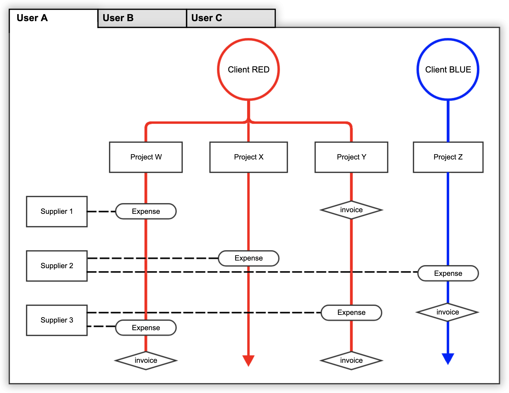
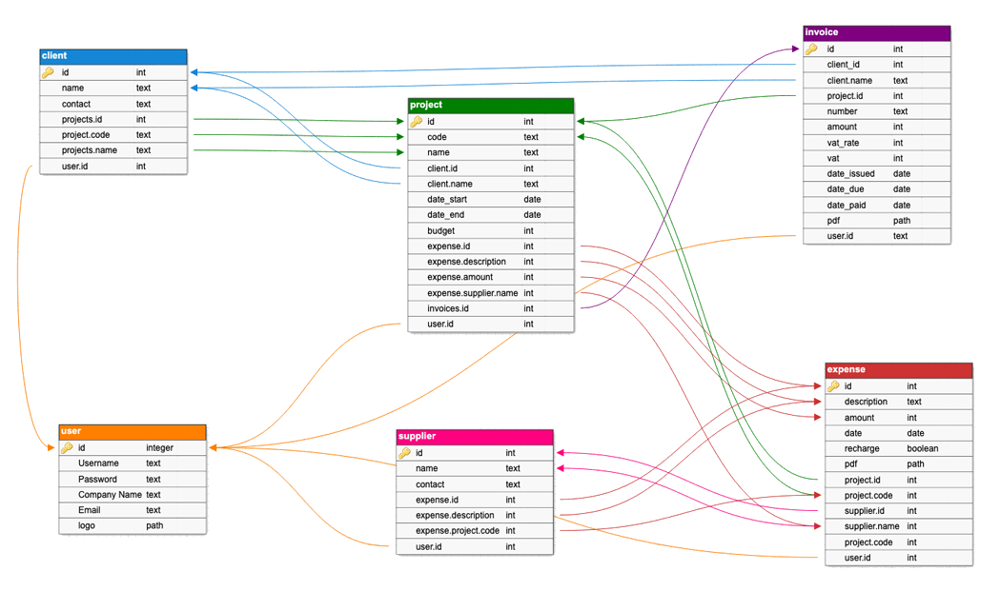
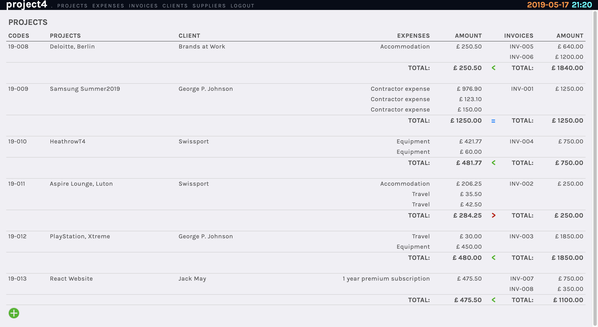
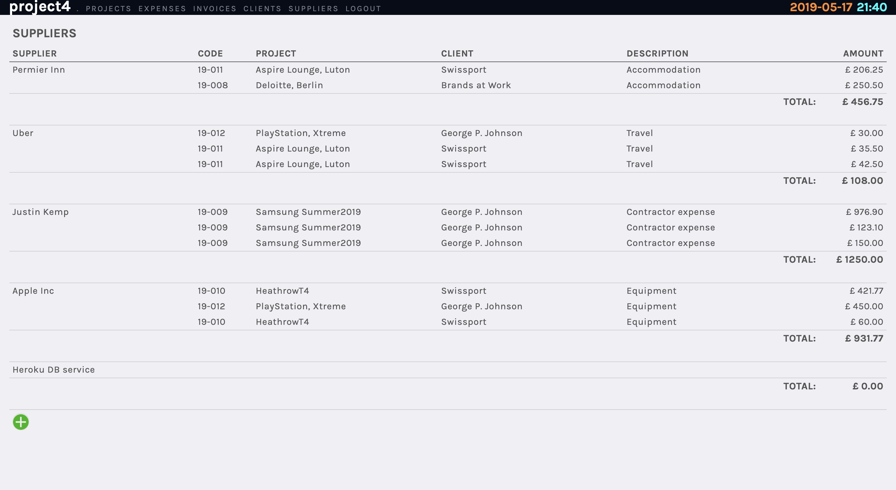

# **Project4**
## Project 4 : Web Development Immersive, General Assembly 

http://www.orjon.com/project4/


## Overview

Born out of my own frustrations, the purpose of this application is to give small businesses a clear oversight of their project-related finances.

The below diagram explains the typical relationships between Projects, Clients, Suppliers, Expenses and Invoices. Each user will have their own unique set of Projects, Clients etc.



The app aims to structure this information through a clean and easily-understood interface to help users monitor their projects over time.

This was my final project completed whilst undertaking the Web Development Immersive course at General Assembly, London. I decided to work on this as a solo project. It was completed in one week.

## Brief


* Build a full-stack application.
* Use a Python Flask API to serve your data from a Postgres database.
* Consume your API with a separate front-end built with React.
* [CRUD](https://en.wikipedia.org/wiki/Create,_read,_update_and_delete) functionality for at least a couple of models.
* Visually impressive design.
* Application must be deployed online.

## Technologies Used
* React.js
* Sass
* Axios
* Python
* Flask
* PostgreSQL
* SQLAlchemy
* Marshmallow
* Yarn
* Git
* GitHub

## Approach Taken

### Database Structure

The first step in creating the database was to define the fields of each table and analyse their relationships. The arrows in the diagram below show fields within tables that are referenced from other tables.



The users in this application do not form part part of the main database structure - however it is their login details that grant them, and not others, access to their project information.

The arrows also illustrate the order in which entries must be made. For instance, an invoice has to be allocated to an existing project, and similarly, a project must be assigned to a client.

### Navigation


page per entity type
clickable interface

### Site Structure & User Journey

The site structure closely follows that of the database; Clients, Projects, Invoices, Suppliers and Expenses are all pages and each displays the users' data arranged accordingly.







Highlight late payments
add / edit / delete buttons


### Screen Layout
The game is divided into two views; the title page and the game page.

The title page shows the game title/logo and a gently pulsing keyboard graphics highlighting the keys used to control the game. Pressing any key takes the player to the game page and starts the game. The page is laid out using Sass and Flexbox. The logo and keyboard graphics are png image with animated opacity applied the keyboard to create the pulsing effect.


The game page shows the 10x20 game grid overlaid on the logo. In the bottom left the game controls “X M S P” are shown and the bottom right shows the player’s score and an email link to the author.


### Grid & Blocks
The grid squares are numbered from left to right and top to bottom, so that each square is ten more than the square directly above it. Above the 20 rows of visible grid squares, there are four invisible rows used to stage the blocks before they fall into view. When a grid square is occupied, its background colour takes on that of the occupying block - giving the impression of the block sitting on the grid.

Each block consists of four squares and has an allocated colour. Blocks are randomly generated in one of seven predefined configurations - the same as in the original Tetris game. The blocks are represented in code as an array of four values corresponding to the numbers of the grid squares occupied by each square in the block.


Blocks fall, one at a time, from the top of the grid until they come to rest at the bottom, or are obstructed from falling further by another block. Once a block has come to rest, it’s array of occupied grid squares is added to an array of all grid squares currently occupied by a non-moving block. Every move and rotate of a falling block is first checked against this array to make sure the move is valid.

To make a block fall one row, ten is added to the value of each square within it.
```Javascript
fall(){
  this.shapePrevious = this.shape.slice()
  for (let i=0; i<this.shape.length; i++) { //loop through each shape pixel
    this.shape[i] += 10 //every pixel below
  }
  this.drawTetri()
}
```

To rotate a block, a rotation matrix is applied to the block’s array. The rotation matrices are unique for each block configuration

```Javascript
rotate(){
  this.rotation += 90
  let rotationMatrix = []
  if (this.rotation === 360) this.rotation = 0
  switch (this.rotation) {
    case 0:
      rotationMatrix = [0,0,-9,0]
      break
    case 90:
      rotationMatrix = [11,0,0,0]
      break
    case 180:
      rotationMatrix = [-11,20,0,0]
      break
    case 270:
      rotationMatrix = [0,-20,9,0]
      break
  }
  if (canRotate(this.shape, rotationMatrix)) {
    for (let i=0; i<this.shape.length; i++) {
      this.shape[i] += rotationMatrix[i]
    }
  } else {
    this.rotation -= 90
    if (this.rotation === -90) this.rotation = 270
  }
}
```

### Controls

The player controls the falling block using the arrow keys for directional movement and the space bar to rotate each block 90º clockwise. Any movement is only permissible of the destination gird squares are not already occupied. Blocks cannot move off the sides of the grid. Other games controls are:

* X - Exit game
* M - Toggle music
* S - Toggle sound effects
* P - Pause game
* *G - Toggle game grid ('hidden' expert mode!)*


### Scoring & Game Speed
Points are scored for each block placed and each line cleared. Additional points are given for clearing multiple horizontal lines together. A point is deducted for every avoidable collision.


| Completed move  | Points        |
| --------------- |:-------------:|
| Block placed    | 10 |
| Sideways collision| -1 |
| 1 line cleared  | 100      |
| 2 lines cleared | 250      |
| 3 lines cleared | 500      |  
| 4 lines cleared | 1000      |

The rate at which the blocks fall increases by 50ms with every 500 points scored.

### Game Flow

The game flow below represents the typical logic in a single clock tick.


### Music & Sound Effects
Music and sound effects are important elements to a computer game. Music helps set the tone of the game and sound effects provide feedback assisting the gameplay.


*The music and sound effects were created for the game by Joe Lewis (<joe@dojostudios.com>), [DojoStudios](http://www.joelewis.info).*

## Bugs
Some known bugs in the game:

* Long key-presses: If a key is held down the resulting block movement can be unpredictable. The

## Wins and Blockers
* Adding four invisible 'staging' rows to the top of the grid made block placement much simpler.


## Possible Additions & Improvements

* Sort options for table data. (choose column, ascendind/descedning etc.)
