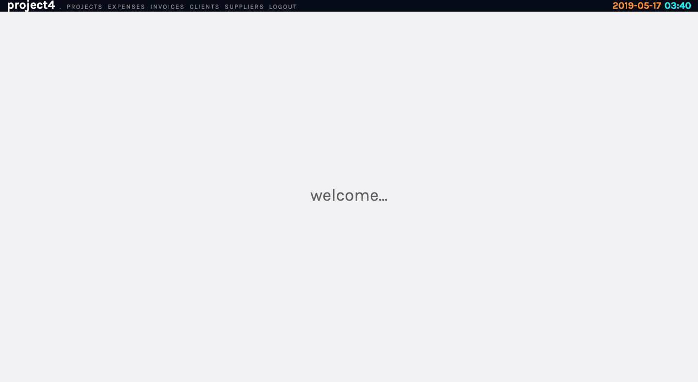
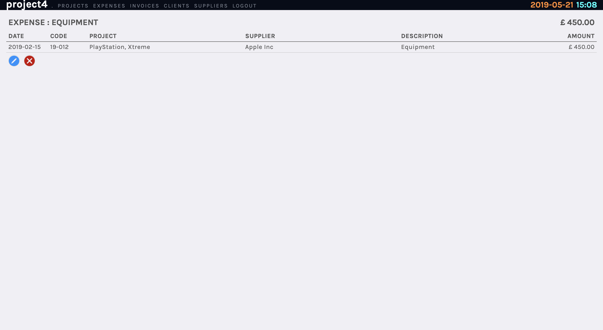

# **Project4**
## Project 4 : Web Development Immersive, General Assembly 

http://www.orjon.com/project4/


## Overview

Born out of my own frustrations, the purpose of this application is to give small businesses a clear oversight of their project-related finances.




This was my final project completed whilst undertaking the Web Development Immersive course at General Assembly, London. I decided to work on this as a solo project. It was completed in one week.

## Brief


* Build a full-stack application.
* Use a Python Flask API to serve your data from a Postgres database.
* Consume your API with a separate front-end built with React.
* [CRUD](https://en.wikipedia.org/wiki/Create,_read,_update_and_delete) functionality for at least a couple of models.
* Visually impressive design.
* Application must be deployed online.

## Technologies Used
* React.js
* Sass
* Axios
* Python
* Flask
* PostgreSQL
* SQLAlchemy
* Marshmallow
* Yarn
* Git
* GitHub

## Approach Taken

### Data Types

The below diagram explains the typical relationships between Projects, Clients, Suppliers, Expenses and Invoices. Each user will have their own unique set of Projects, Clients etc.


The app aims to structure this information through a clean and easily-understood interface to help users monitor their projects over time.

### Database Structure

The first step in creating the database was to define the fields of each table and analyse their relationships. The arrows in the diagram below show fields within tables that are referenced from other tables.


The users in this application do not form part part of the main database structure - however it is their login details that grant them, and not others, access to their project information (Every page within the site is thus a secure-route requiring appropriate authorization for access).

The arrows also illustrate the order in which entries must be made. For instance, an invoice has to be allocated to an existing project, and similarly, a project must be assigned to a client.

### Site Structure & Navigation

The site structure closely follows that of the database; Clients, Projects, Invoices, Suppliers and Expenses are all pages and each displays the users' data arranged accordingly.

Most of the items listed on a page are clickable hyperlinks, taking the user to that specific entry. This is achieved by using Link tags for each entry:

```Javascript
const ProjectList = (props) => {
  const project = props.project

  return (
    <div className='tableRow'>
      <div className='rowLeft'>
        <div className='cellCode'>
          <Link to={`/project/${project.id}`} className='cell'>
            {project.code}
          </Link>
        </div>
      </div>
      <div className='rowCentre'>
        <div className='cellQuarter'>
          <Link to={`/project/${project.id}`} className='cell'>
            {project.name}
          </Link>
        </div>
        <div className='cellQuarter'>
          <Link to={`/clients/${project.client.id}`} className='cell'>
            {project.client.name}
          </Link>
        </div>
        <div className='cellQuarterRight'>
          {project.expenses && project.expenses.map(expense => (
            <div key={expense.id} className="lineItem">
              <Link to={`/expenses/${expense.id}`} className='cell'>
                {expense.description}
              </Link>
            </div>
          ))}
        </div>
        <div className='cellCurrency'>
          {project.expenses && project.expenses.map(expense => (
            <div key={expense.id} className="lineItem">
              <Link to={`/expenses/${expense.id}`} className='cell'>
                £&thinsp;{expense.amount.toFixed(2)}
              </Link>
            </div>
          ))}
        </div>
        <div className='cellComparator'>
          <div className='lineItem summary'>
            <div>&#32;</div>
          </div>
        </div>
        <div className='cellCodeRight'>
          {project.invoices && project.invoices.map(invoice => (
            <div key={invoice.id} className="lineItem">
              <Link to={`/invoice/${invoice.id}`} className='cell'>
                {invoice.number}
              </Link>
            </div>
          ))}
        </div>
        <div className='cellCurrency'>
          {project.invoices && project.invoices.map(invoice => (
            <div key={invoice.id} className="lineItem">
              <Link to={`/invoice/${invoice.id}`} className='cell'>
                £&thinsp;{invoice.amount.toFixed(2)}
              </Link>
            </div>
          ))}
        </div>
      </div>
    </div>
  )
}
```

The navigation menu at the top of the page allows users to easily switch between pages - although the application is fully navigable via hyperlinks within the pages.

For convenience, there is a current date and time displayed at the top right of the navigation bar. This is particularly useful when recording dates into the system and serves as a handy reminder of when it's time to go home.

#### Projects
The projects page lists a summary of all the users projects. It shows the project name and code, and the name of the client. All related expenses and issued invoices are shown in columns on the right. These are them summed and compared with colour-coded equality/inequality symbols.


At the bottom of the page is a green + icon which opens a modal and allows new projects to be added.


Clicking on any project code or title, will open up the individual project summary page. This page lists all entries related to that project. Invoices that are overdue are highlighted in red. Paid invoices are shown in a lighter grey. Again, these entries are clickable hyperlinks. At the bottom of this page are self-explanatory edit and delete icons.


#### Expenses

The expenses page shows a list of project-agnostic expenses. All entries are clickable hyperlinks


Clicking on an expense will show that expenses in an isolated view with the option to edit or delete the entry.



#### Invoices

The invoices page shows a project-agnostic list of all issued invoices. The total of all entries is listed at the top of the page, and total due and overdue listed at the bottom. Overdue invoices are highlighted in red, and settled invoice in a light grey. Adding a new invoice is done with the + icon at the bottom of the page. Just as with all new entries, this bring forward a modal for the user to enter information.


Clicking on an invoice will open up that particular invoice with options to edit and delete the entry. Once an invoice has been paid the entry should be edited to record the payment date.


#### Clients & Suppliers

The Clients and Suppliers pages list a user's clients and suppliers respectively. More can be added with the green + icon at the bottom of the page, and - just as the other pages - clicking on an entry will open a page on that client/supplier and allow the user to edit or delete the entry.


## Wins and Blockers

* As this was my first full stack react application created alone - it was a great learning experience.

* Planning the data structure, creating routes, and testing everything using Insomnia was very useful.


## Bugs
Some known bugs:

* I had difficulty in pre-populating date fields. The problem occurs when editing an existing entry that has a date field - such as when editing an invoice. The edit modal will not populate the date fields with the existing information - they will appear empty. They still function correctly however.

* The cross hyper-linking was decided at a relatively late stage in development. As such, there are few places where the hyperlinks have not been added.

## Future improvements

* Time was short to create all of this by myself within a week. With more time I would have created a bigger seed file to test behaviour when the data flows over the length of a single page.

* I would like to add sort options for table data. It would be useful to be able to choose a column with which to sort, ascending/descending, and perhaps a search/filter too.

* I have started work a dashboard page. I'd like to expand on this, and have this as the default page when I user logs in.


